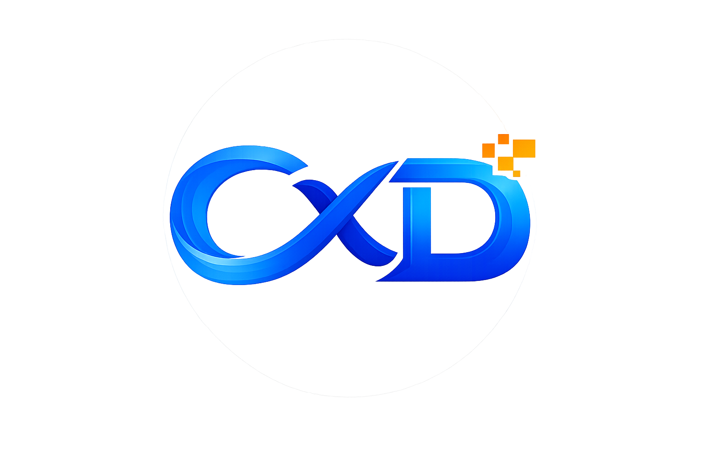

**CortexDocs AI**
=================



CortexDocs AI is a full-stack AI-powered document intelligence web application that allows users to upload PDF, DOC, and DOCX documents and interact with them through a conversational interface. Built on a Retrieval-Augmented Generation (RAG) architecture, the system extracts document text, segments it into semantic chunks, generates vector embeddings, and performs similarity-based retrieval to ensure that every response is grounded strictly in user-uploaded content.

The platform integrates secure authentication, document management, semantic search, and conversational AI into a single streamlined workflow. Users can upload individual files or bulk ZIP archives, manage stored documents, and ask contextual follow-up questions within a persistent chat interface. By combining vector search with controlled LLM prompting, CortexDocs AI minimizes hallucination and delivers accurate, document-backed answers.

CortexDocs AI is designed for university students, professionals, and internal teams who frequently work with long reports, technical documentation, policies, or assessment materials. It transforms static documents into an interactive knowledge system, significantly reducing the time required to locate and understand critical information.

For more details of CortexDocs AI, please visit /docs/prd.md to view the Product Requirements Document (PRD).

**CortexDocs AI Demo Video**
----------------------------

[](https://youtu.be/Rbnb-_V__vo)

**Tech Stack**
--------------


| Layer    | Technology / Tools                                    |
| -------- | ----------------------------------------------------- |
| Frontend | React (Vite), Tailwind CSS, React Router, Supabase JS |
| Backend  | Node.js (Express), Supabase Admin                     |
| Database | Supabase PostgreSQL                                   |
| AI Layer | BAAI/bge-base-en-v1.5 (Embeddings), Llama 3.1 (Groq)  |

**Prerequisites**
-----------------

Ensure the following software is installed:

- Node.js (v18 or higher)
- npm (comes with Node)
- Docker (optional, for containerized deployment)
- A Supabase account (free tier is sufficient)

**Database and Environment Setup (Required Before Running the App)**
--------------------------------------------------------------------

CortexDocs AI uses Supabase for authentication, database storage, vector search, and file storage.

**1\. Create a Supabase Project**

1. Go to: https://supabase.com
2. Create a new project
3. Wait for the database to finish provisioning

**2\. Run the Database Schema**

1. Open your Supabase project
2. Navigate to **SQL Editor**
3. Create a new query
4. Copy and paste the contents of `/database/schema.sql`
5. Click **Run**

**3\. Obtain Supabase Project URL and API Keys**

1. Go to Project Overview
2. Copy Project URL
3. Go to Project Settings → API Keys
4. Copy Publishable Key and Secret Key
5. Add them to your frontend and backend `.env` files accordingly (see below)
6. Go to Authentication → Sign In/Providers → toggle off Confirm email → click Save changes

**4\. Create Frontend Env**

Create frontend/.env:

```
VITE_SUPABASE_URL=your_supabase_url
VITE_SUPABASE_PUBLISHABLE_KEY=your_supabase_publishable_key
VITE_BACKEND_URL=http://localhost:8080
```

**5\. Create Backend Env**

Create backend/.env:

```
PORT=8080
SUPABASE_URL=your_supabase_url
SUPABASE_SECRET_KEY=your_supabase_secret_key
EMBED_MODEL_API_TOKEN=your_embedding_key
EMBED_MODEL=BAAI/bge-base-en-v1.5
GROQ_API_KEY=your_llm_key
GROQ_MODEL=llama-3.1-8b-instant
```

Note 1: For development simplicity, email confirmation is disabled. In Supabase, go to Authentication → Sign In/Providers → toggle off Confirm email → click Save changes, and then sign up a new user without confirmation email.

Note 2: The embedding model in backend/.env must match the database vector dimension (768). If you change the model, update the vector column dimension accordingly.

**Local Deployment (Without Docker)**
-------------------------------------

Run the below commands:

```
cd frontend
npm install
npm run dev
```

Then run the below commands in a separate terminal:

```
cd backend
npm install
npm run dev
```

Frontend runs at http://localhost:5173, while backend runs at http://localhost:8080

**Docker Deployment**
---------------------

Ensure Docker is installed, then from the project root:

```
docker compose up --build
```

The application will be available at:

* Frontend: http://localhost:5173
* Backend: http://localhost:8080
